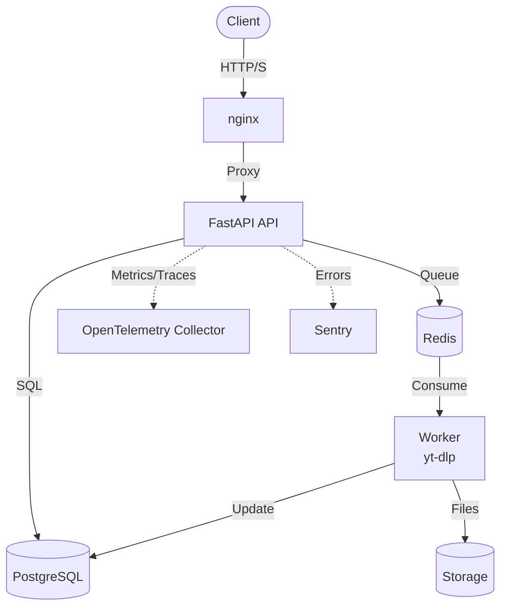

<div align="center">

# Vooglaadija

*Pronounced voo-gla-tee-ya* — Media Link Processor

Async video media extraction API with job queue and real-time status streaming.

[](https://www.python.org/)
[](https://www.gnu.org/licenses/gpl-3.0.html)
[](https://github.com/tomkabel/team21-vooglaadija)
[](https://fastapi.tiangolo.com/)
[](https://www.docker.com/)
[](https://www.postgresql.org/)
[](https://redis.io/)
[](https://github.com/yt-dlp/yt-dlp)

</div>

<div align="center">
  
</div>

<div align="center">

**Built by** [](https://github.com/tomkabel) [](https://github.com/Kevindaman) [](https://github.com/triinum)

**Acknowledgements** [](https://github.com/Migfive) [](https://github.com/DrWarpMan) [](https://github.com/Snazzah) [](https://github.com/wukko) [](https://github.com/Blobadoodle) [](https://github.com/nexpid)

</div>

---

## Contents

- [Overview](#overview)
- [Features](#features)
- [Quick Start](#quick-start)
- [Usage](#usage)
- [Documentation](#documentation)
- [Tech Stack](#tech-stack)
- [Architecture](#architecture)
- [License](#license)

---

## Overview

Vooglaadija is an async REST API for extracting media from video URLs. It uses [yt-dlp](https://github.com/yt-dlp/yt-dlp) as the extraction engine and currently accepts YouTube URLs. The architecture separates the FastAPI web layer from a Redis-backed worker process.

The system includes JWT authentication, CSRF protection, rate limiting, structured logging, Prometheus metrics, OpenTelemetry tracing, and Sentry error tracking. A server-rendered web UI built with HTMX and Tailwind CSS provides job management with real-time status updates via Server-Sent Events.

---

## Features

### Core Processing
- Media extraction via yt-dlp (YouTube-optimized)
- Async job queue with Redis-backed worker
- Job lifecycle: pending → processing → completed/failed
- Automatic retry with exponential backoff and jitter
- Time-limited download links (default 24h)
- Stale job reaper for orphaned processing jobs

### Security & Reliability
- JWT access/refresh tokens with bcrypt hashing
- CSRF token protection
- Per-IP and per-user rate limiting
- Content-Security-Policy headers
- Safe file serving with path traversal protection
- Circuit breaker for yt-dlp extraction failures
- Transactional outbox for crash-safe job creation
- Graceful worker shutdown with job draining

### Observability
- SSE real-time status streaming
- Prometheus metrics endpoint
- Structured JSON logging (structlog)
- OpenTelemetry tracing support
- Sentry error tracking

---

## Quick Start

### Docker Compose (Recommended)

```bash
git clone https://github.com/tomkabel/team21-vooglaadija.git
cd team21-vooglaadija
docker compose up -d
```

The stack runs API, Worker, PostgreSQL, Redis, nginx, OpenTelemetry Collector, and Swagger UI.

### Local Development

```bash
git clone https://github.com/tomkabel/team21-vooglaadija.git
cd team21-vooglaadija
hatch env create

cp .env.example .env
# Minimum required:
#   DB_PASSWORD=<strong-password>
#   REDIS_PASSWORD=<strong-password>
#   SECRET_KEY=$(python -c "import secrets; print(secrets.token_hex(32))")

hatch run db-migrate
hatch run dev              # API
python -m worker.main      # Worker (separate terminal)
```

### Access Points

- Web Dashboard: http://localhost:8000/web/downloads
- Login: http://localhost:8000/web/login
- API Docs: http://localhost:8000/docs
- Standalone Swagger: http://localhost:8081

---

## Usage

### Register

```bash
curl -X POST http://localhost:8000/api/v1/auth/register \
  -H "Content-Type: application/json" \
  -d '{"email": "user@example.com", "password": "securepassword123"}'
```

### Login

```bash
curl -X POST http://localhost:8000/api/v1/auth/login \
  -H "Content-Type: application/json" \
  -d '{"email": "user@example.com", "password": "securepassword123"}'
```

### Create a download job

```bash
curl -X POST http://localhost:8000/api/v1/downloads \
  -H "Authorization: Bearer YOUR_ACCESS_TOKEN" \
  -H "Content-Type: application/json" \
  -d '{"url": "https://www.youtube.com/watch?v=aqz-KE-bpKQ"}'
```

**Note:** The current deployment accepts YouTube URLs via yt-dlp.

### Error example (422 Validation Error)

```bash
curl -X POST http://localhost:8000/api/v1/downloads \
  -H "Authorization: Bearer YOUR_ACCESS_TOKEN" \
  -H "Content-Type: application/json" \
  -d '{"url": "not-a-url"}'
```

Expected response:
```json
{
  "error": {
    "code": "VALIDATION_ERROR",
    "message": "Request validation failed"
  },
  "details": {
    "validation_errors": [
      {
        "field": "url",
        "message": "Value error, Must be a valid YouTube URL",
        "type": "value_error"
      }
    ]
  }
}
```

See [docs/API.md](docs/API.md) for the full endpoint reference, request/response schemas, and status codes.

---

## Documentation

| Document | Description |
|----------|-------------|
| [docs/API.md](docs/API.md) | Full API reference with auth requirements, status codes, and schemas |
| [docs/ARCHITECTURE.md](docs/ARCHITECTURE.md) | System architecture and component responsibilities |
| [docs/CONTRIBUTING.md](docs/CONTRIBUTING.md) | Development workflow, tests, and code standards |
| [docs/OPS.md](docs/OPS.md) | Environment variables, deployment, and troubleshooting |

---

## Tech Stack

| Technology | Purpose |
|------------|---------|
| Python 3.12+ | Runtime |
| FastAPI | API framework |
| SQLAlchemy | ORM |
| PostgreSQL | Database |
| Redis | Queue and cache |
| Docker | Containerization |
| nginx | Reverse proxy |
| Tailwind CSS | Frontend styling |
| Prometheus | Metrics |
| sse-starlette | Real-time updates |
| GitHub Actions | CI/CD |

### Runtime Dependencies

- `python-jose[cryptography]` — JWT handling
- `passlib[bcrypt]` — Password hashing
- `yt-dlp` — Media extraction
- `sse-starlette` — Server-Sent Events
- `prometheus-client` — Metrics
- `slowapi` — Rate limiting
- `structlog` — Structured logging
- `orjson` — Fast JSON serialization
- `uvloop` — Async event loop
- `tenacity` — Retry logic
- `sentry-sdk` — Error tracking

### System Dependencies

- `Node.js` — yt-dlp JavaScript signature solving
- `ffmpeg` — Media merging and transcoding

---

## Architecture



The API server handles authentication, job management, HTMX rendering, SSE streaming, and observability. The worker consumes jobs from Redis, extracts media via yt-dlp, and manages file lifecycle. See [docs/ARCHITECTURE.md](docs/ARCHITECTURE.md) for the full diagram and component details.

---

## License

GNU General Public License v3.0. See [LICENSE](LICENSE).

---

<div align="center">

[](https://github.com/tomkabel/team21-vooglaadija)
[](https://github.com/tomkabel/team21-vooglaadija/issues)

</div>
