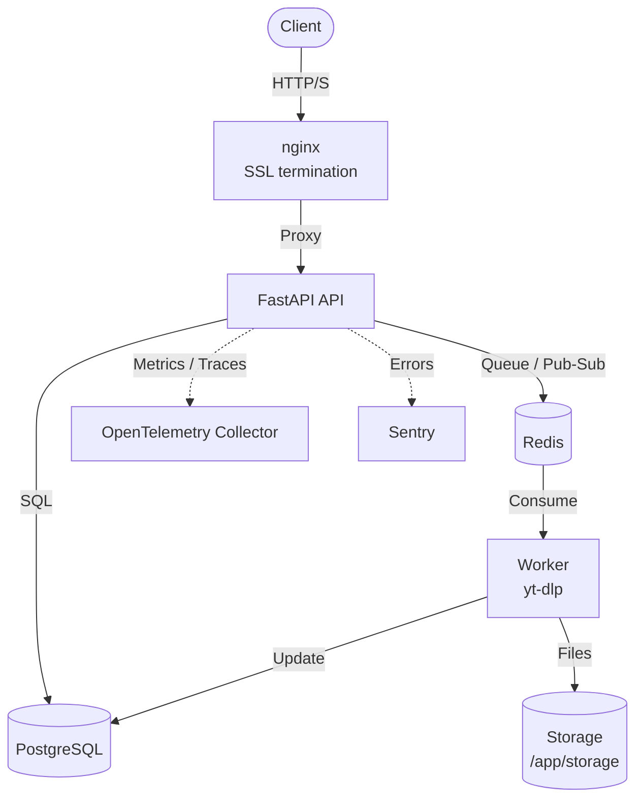

# Architecture

## System Diagram

## Component Responsibilities

### API Server (FastAPI)

- **Authentication:** Register, login, token refresh, logout. Passwords hashed with bcrypt. JWT access tokens (15 min) and refresh tokens (7 days).
- **Job Management:** CRUD operations for download jobs with pagination and filtering.
- **File Delivery:** Stream processed files with path-traversal protection and expiration checks.
- **Web UI:** Server-rendered HTMX pages with Tailwind CSS. CSRF token generation and validation on state-changing routes.
- **Real-Time Updates:** SSE endpoint (`/web/downloads/stream`) pushes live job status to browser dashboards.
- **Rate Limiting:** Per-IP and per-user limits via SlowAPI.
- **Security Headers:** Content-Security-Policy, X-Content-Type-Options, X-Frame-Options on all responses.
- **Observability:** Prometheus metrics at `/metrics`, structured JSON logging via structlog, OpenTelemetry instrumentation.
- **Health Probes:** `/health` (liveness) and `/health/ready` (readiness, checks DB + Redis).

### Worker Process

- **Job Consumption:** Polls Redis queue for pending download jobs.
- **Media Extraction:** Executes yt-dlp with circuit breaker protection to prevent cascading failures during YouTube rate limits or signature changes.
- **Status Updates:** Writes job progress (`pending` → `processing` → `completed`/`failed`) to PostgreSQL.
- **File Lifecycle:** Stores downloaded files to local storage, enforces expiration, and cleans up orphaned files.
- **Crash Safety:** Transactional outbox pattern ensures the ordering between database commit and queue enqueue is durable. If the API crashes after committing the job to the database but before enqueuing it to Redis, the outbox recovery process will enqueue it on the next worker startup. This pattern does not protect against crashes during active extraction; those are handled by automatic retries and the stale-job reaper instead.
- **Retry Logic:** Automatic retry with exponential backoff + jitter for transient yt-dlp failures.
- **Stale Job Reaper:** Background task that resets jobs stuck in `processing` longer than a configured threshold.
- **Graceful Shutdown:** On SIGTERM, stops accepting new jobs, completes in-flight extraction, then exits.
- **Health Endpoint:** Internal HTTP server on port 8082 for container orchestration health checks.

### Data Stores

| Store | Role |
|-------|------|
| **PostgreSQL** | Persistent storage for users, download jobs, and outbox records. |
| **Redis** | Job queue, cache for rate-limit counters, and SSE pub/sub channel. |
| **Local Storage** | Time-limited download files. Cleaned up by the worker after `FILE_EXPIRE_HOURS`. |

### Observability Stack

| Component | Role |
|-----------|------|
| **OpenTelemetry Collector** | Receives traces and metrics from the API via OTLP/gRPC. |
| **Sentry** | Crash reporting and performance monitoring (optional, configured via `SENTRY_DSN`). |
| **NetData** | Host-level system metrics (optional, configured via `NETDATA_CLAIM_TOKEN`). |
| **Prometheus** | Scrapes `/metrics` for endpoint-level request latency and throughput. |
