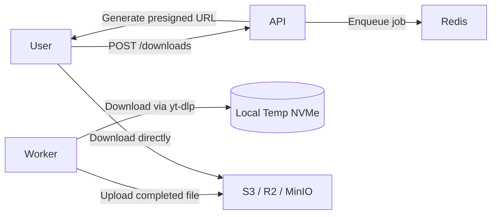

# Storage Management Analysis & Recommendations

**Date:** 2026-04-26
**Context:** Analysis of how the project handles SSD/storage space exhaustion from user downloads, and recommended architecture changes.

---

## 1. Current Storage Handling

The project stores downloaded files on the **local filesystem** inside a Docker volume (`storage`) shared between the API and worker containers:

```yaml
# docker-compose.yml
volumes:
  - storage:/app/storage:Z
```

Files are written to `storage/downloads/` by the worker during `yt-dlp` extraction and served back to users via `FileResponse` from the API.

### Current Cleanup Mechanisms

| Mechanism | Implementation | Frequency |
|-----------|---------------|-----------|
| Expired file cleanup | `cleanup_expired_jobs()` in `worker/main.py` | Every 5 minutes (`CLEANUP_INTERVAL_MINUTES=5`) |
| Partial download cleanup | `_cleanup_downloaded_file()` in `worker/processor.py` | On worker shutdown / cancellation |
| User-initiated deletion | `delete_download()` in `app/api/routes/downloads.py` | On API call |
| Zombie job recovery | `requeue_stuck_jobs()` in `worker/zombie_sweeper.py` | Background polling (requeues, does not delete) |

Files expire after **24 hours** by default (`FILE_EXPIRE_HOURS=24`). The worker deletes both the physical file and the corresponding DB record once `expires_at` has passed.

### Existing Code References

- `app/config.py` — `storage_path: str = "./storage"`, `file_expire_hours: int = 24`
- `worker/main.py` — `cleanup_expired_jobs()` loops over `DownloadJob.status == "completed"` where `expires_at < now`
- `worker/processor.py` — `_cleanup_downloaded_file()` removes partial files on requeue or shutdown
- `app/api/routes/downloads.py` — `_validate_file_path()` prevents path traversal; `delete_download()` removes file then DB row

---

## 2. Critical Gaps

The current implementation has **no protection against disk exhaustion**:

1. **No pre-download space check** — `yt-dlp` starts downloading blindly. If the disk fills mid-download, the job fails with an I/O error that may be retried, wasting bandwidth and CPU.
2. **No per-file size limit** — A single 4K/8K video can consume 5–20 GB.
3. **No per-user quota** — One user could fill the entire shared disk.
4. **No emergency eviction** — If storage fills before the 24-hour expiration window, new downloads halt for *all* users.
5. **No disk usage metrics** — Prometheus/Grafana cannot alert on `storage_used_bytes` or `storage_available_bytes`.
6. **No orphan file sweeper** — `yt-dlp` and `ffmpeg` may leave `.part`, `.temp`, or `ytdl` temp files on crash/OOM that are never referenced by the DB.
7. **No temp directory cleanup** — `storage/temp/` exists but has no automated cleanup routine.

---

## 3. Recommended Solution Architecture

Implement a **layered storage management** strategy:

### 3.1 Pre-Download Guardrails

Check available disk space and estimated file size *before* starting `yt-dlp`.

```python
# app/services/storage_guard.py (proposed)
import shutil
import os

async def can_accept_download(
    storage_path: str, estimated_bytes: int | None = None
) -> tuple[bool, str]:
    """Check if storage can accept a new download."""
    total, used, free = shutil.disk_usage(storage_path)

    # Reserve 10 % of disk for OS / container overhead
    usable = free - int(total * 0.10)

    # Default max single download: 5 GB if size is unknown
    required = estimated_bytes or (5 * 1024 * 1024 * 1024)

    if required > usable:
        return (
            False,
            f"Insufficient space: {free // 1024 // 1024} MB free, "
            f"{required // 1024 // 1024} MB required",
        )

    return True, ""
```

Add a `MAX_FILE_SIZE_BYTES` config (default 5–10 GB). Use `yt-dlp`'s `filesize_approx` metadata to validate *before* the full download begins.

### 3.2 Per-User Quota Enforcement

Add `storage_quota_bytes` to the `User` model (default ~1 GB). Before enqueuing a job, sum the file sizes of the user's `completed` jobs and reject if the new download would exceed quota.

### 3.3 Emergency LRU Eviction

When free space drops below a threshold (e.g., 15 %), evict the oldest `completed` files **regardless** of their `expires_at`:

```python
async def emergency_cleanup(
    storage_path: str, threshold_percent: float = 15.0
) -> int:
    """Evict oldest completed downloads when disk is critically low."""
    total, used, free = shutil.disk_usage(storage_path)
    if (free / total) * 100 > threshold_percent:
        return 0

    # Delete oldest completed files from DB + disk until above threshold
    ...
```

Run this check inside the existing cleanup loop in `worker/main.py` alongside `cleanup_expired_jobs()`.

### 3.4 Orphan File Sweeper

A background task (weekly or daily) that scans `storage/downloads/` for files **not referenced** by any `completed` or `processing` job in the database, and deletes them. This catches crashes that leave files without DB records.

### 3.5 Prometheus Metrics

Expose custom metrics (e.g., via `app/metrics.py`):

- `storage_total_bytes`
- `storage_free_bytes`
- `storage_used_bytes`
- `downloads_active_bytes` (sum of non-expired completed files)
- `downloads_rejected_total` (counter, labeled by `reason`: `quota`, `disk_full`, `file_too_large`)

---

## 4. Server Specs for Deployment

The current `docker-compose.yml` resource limits are:

| Service | CPU Limit | RAM Limit |
|---------|-----------|-----------|
| API | 1.0 | 1 GB |
| Worker | 1.0 | 1 GB |
| PostgreSQL | 1.5 | 1 GB |
| Redis | 0.5 | 256 MB |

For a YouTube downloader, **storage throughput and network bandwidth** matter far more than raw CPU/RAM.

| Scale | Concurrent Downloads | Recommended Storage | Recommended RAM | Notes |
|-------|---------------------|---------------------|-----------------|-------|
| Hobby (< 50 users/day) | 1–2 | 100–250 GB SSD | 2 GB | Current limits are fine. |
| Small (< 500 users/day) | 3–5 | 500 GB – 1 TB NVMe | 4 GB | ffmpeg merging spikes RAM; give worker 2–4 GB. |
| Medium (< 5 K users/day) | 10–20 | 2–5 TB NVMe | 8–16 GB | Requires object storage or multiple SSDs. |

### Hardware Considerations

- **Storage type:** NVMe SSD is mandatory. Sequential writes from `yt-dlp` plus temp file churn from `ffmpeg` will destroy HDD performance.
- **Network bandwidth:** The worker needs high downstream bandwidth. A 1080p download at 50 Mbps sustained × 5 concurrent = 250 Mbps minimum.
- **IOPS:** ffmpeg's temp file churn during merge is I/O heavy; provision at least 10 K IOPS.
- **Disk redundancy:** Use RAID 1 or RAID 10 for local storage; a single disk failure should not lose all pending/completed downloads.

---

## 5. Should the Project Use 3rd Party Storage?

**Yes, for any non-trivial deployment.**

The current architecture couples storage to the worker node's local filesystem. This prevents horizontal scaling: you cannot safely add more worker nodes without a shared filesystem (e.g., NFS), which introduces complexity, single points of failure, and locking issues.

### Recommended: S3-Compatible Object Storage

| Provider | Best For | Egress Fees |
|----------|----------|-------------|
| **Cloudflare R2** | Serving downloads directly via signed URLs | None |
| **Backblaze B2** | Cheap long-term archival | Moderate |
| **AWS S3 + CloudFront** | Enterprise / global CDN | High |
| **MinIO (self-hosted)** | On-premise / data-sovereignty requirements | N/A |

### Proposed Architecture Change



**Benefits:**

1. **Infinite scale** — Storage is no longer tied to the worker node's disk size.
2. **Direct-to-user delivery** — Users download from the CDN / object store, not the API container, freeing API bandwidth.
3. **No disk exhaustion** — Bucket quotas and lifecycle policies handle expiration automatically.
4. **Horizontal scaling** — Workers become stateless. You can add 10 worker replicas without storage concerns.
5. **Cost optimization** — Object storage is cheaper per-GB than block storage (EBS / persistent volumes).

### Implementation Approach

1. Add an abstraction layer: `app/services/storage_backend.py` with:
   - `LocalStorageBackend` (current behavior)
   - `S3StorageBackend` (new)
2. Worker uploads the completed file to the configured backend after `yt-dlp` finishes.
3. Store the object key (or presigned URL) in `DownloadJob.file_path` (or a new `file_url` column).
4. API redirects (`307 Temporary Redirect`) or streams from the object store when the user hits `GET /downloads/{id}/file`.
5. Set bucket lifecycle rules to auto-delete objects after 24 hours as a safety net behind the worker cleanup.

### Hybrid Option (Immediate Improvement)

Keep local NVMe storage but add **automatic offloading**:

- Download to local NVMe for speed.
- After 1 hour (or when local disk hits 70 % usage), upload completed files to cold object storage.
- Serve from local disk if available (fast); otherwise redirect to object storage.

This balances download performance with capacity.

---

## 6. Action Items

| Priority | Task | Effort |
|----------|------|--------|
| **High** | Add `storage_guard.py` with disk-space check before `yt-dlp` starts | Small |
| **High** | Add `MAX_FILE_SIZE_BYTES` config and reject oversized jobs | Small |
| **High** | Implement orphan file sweeper (scan `storage/downloads` vs DB) | Medium |
| **Medium** | Add per-user `storage_quota_bytes` to `User` model + enforcement | Medium |
| **Medium** | Add emergency LRU eviction when disk < 15 % free | Medium |
| **Medium** | Add Prometheus metrics for disk usage | Small |
| **Low** | Implement `S3StorageBackend` abstraction + R2/S3 integration | Large |
| **Low** | Evaluate hybrid local + object storage offload strategy | Large |

---

## 7. Related Files

- `app/services/yt_dlp_service.py` — Download logic, temp file creation
- `worker/processor.py` — Job processing, partial file cleanup
- `worker/main.py` — Main loop, `cleanup_expired_jobs()`
- `worker/zombie_sweeper.py` — Stuck job requeuing
- `app/api/routes/downloads.py` — File serving and user deletion
- `app/config.py` — `storage_path`, `file_expire_hours`
- `docker-compose.yml` — Volume mounts, resource limits
