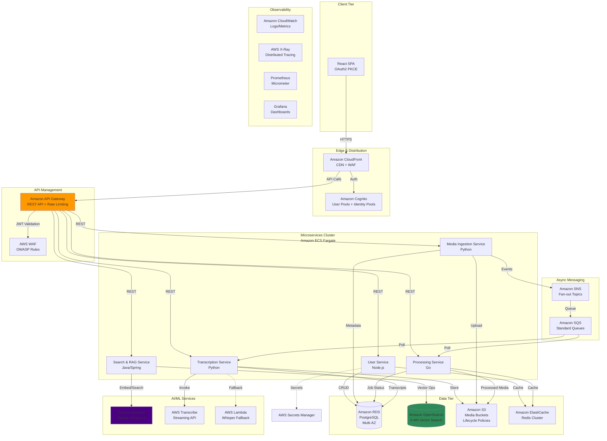
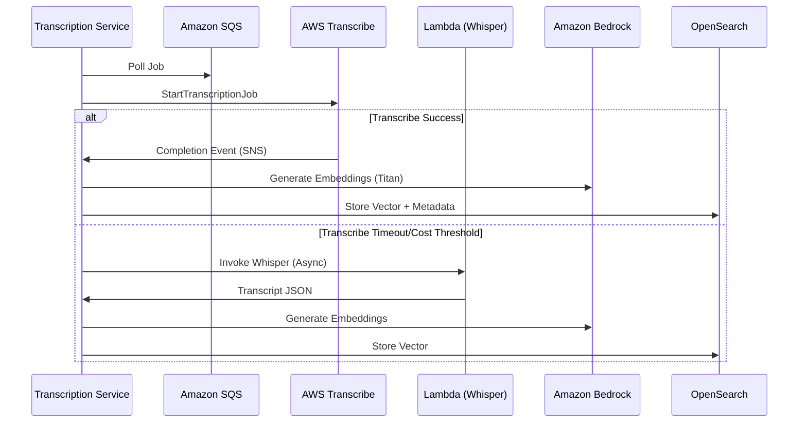

# Architecture Design Document: Media Processing & RAG Platform

## 1. Executive Summary

This document presents the architectural blueprint for a scalable, microservices-based media processing platform enabling YouTube content ingestion, browser-based editing, AI-powered transcription, and Retrieval-Augmented Generation (RAG) capabilities. The architecture leverages AWS cloud-native services, containerization, and event-driven patterns to deliver sub-second API response times and cost-optimized processing.

**Course Topics Alignment Matrix:**
| Section | Git | Testing | Code Quality | AWS | CI/CD | Performance | Profiling | DB Optimization | Cost Analysis | Architecture | Security | Observability | AI/ML |
|---------|-----|---------|--------------|-----|-------|-------------|-----------|-----------------|---------------|--------------|----------|---------------|-------|
| 2. System Architecture | | | | ✓ | | | | | | ✓ | | | |
| 3. Microservices | | ✓ | ✓ | ✓ | | ✓ | | ✓ | | ✓ | ✓ | ✓ | ✓ |
| 4. Data Architecture | | | | ✓ | | | | ✓ | ✓ | | | | |
| 5. Security | | | ✓ | ✓ | | | | | | | ✓ | | |
| 6. AI/ML Integration | | | | ✓ | | ✓ | | | | ✓ | | | ✓ |
| 7. IaC | ✓ | | ✓ | ✓ | ✓ | | | | ✓ | | ✓ | | |
| 8. CI/CD | ✓ | ✓ | ✓ | ✓ | ✓ | | | | | | ✓ | | |
| 9. Observability | | ✓ | | ✓ | | | ✓ | | | | | ✓ | |
| 10. Performance | | | | ✓ | | ✓ | ✓ | ✓ | ✓ | | | | |
| 11. Cost Analysis | | | | | | | | | ✓ | | | | |
| 12. Roadmap | ✓ | ✓ | | ✓ | ✓ | | | | ✓ | ✓ | | | |

---

## 2. System Architecture Overview

### 2.1 High-Level Architecture Diagram



### 2.2 Data Flow Architecture

**Synchronous Flow (User Operations):**
1. Client authenticates via Cognito OAuth2 PKCE flow → receives JWT
2. API Gateway validates JWT via Lambda Authorizer
3. Services process requests with ElastiCache session caching
4. RDS read replicas handle GET operations; write operations target primary

**Asynchronous Flow (Media Processing):**
1. Media Ingestion Service publishes `MediaUploaded` event to SNS
2. SNS fans out to SQS queues for Processing and Transcription services
3. Processing Service updates job status in RDS; stores artifacts in S3
4. Transcription Service invokes AWS Transcribe; fallback to Lambda-hosted Whisper for cost optimization
5. Completed transcripts trigger RAG embedding pipeline via Bedrock

---

## 3. Microservices Specifications

### 3.1 Service Topology & Database Isolation

| Service | Language | Database | Schema | AWS Integration | Course Alignment |
|---------|----------|----------|--------|----------------|------------------|
| **User Service** | Node.js/Express | RDS PostgreSQL | `users` | Cognito, Secrets Manager | Security (JWT), DB Optimization (indexing) |
| **Media Ingestion** | Python/FastAPI | RDS PostgreSQL | `media_metadata` | S3, SQS | Code Quality (type hints), AWS (S3 policies) |
| **Processing Service** | Go | RDS PostgreSQL | `processing_jobs` | ECS, EBS (temp), FFmpeg WASM | Performance (Go concurrency), Profiling (pprof) |
| **Transcription Service** | Python/Celery | RDS PostgreSQL | `transcripts` | Transcribe, Lambda, Bedrock | AI/ML (Transcribe/Bedrock), Testing (mock AWS) |
| **Search & RAG** | Java/Spring Boot | OpenSearch | `vectors` + `indices` | Bedrock, OpenSearch k-NN | DB Optimization (vector indexing), Architecture (CQRS) |

### 3.2 API Gateway Configuration

**AWS Service:** Amazon API Gateway (REST API)

**Security & Configuration:**
- **JWT Validation:** Cognito User Pool authorizer with `Authorization` header validation
- **CORS:** Preflight headers configured for `https://domain.com` origin only
- **Rate Limiting:** 1000 requests/second per API key; burst capacity 2000
- **Request Validation:** JSON Schema validation for request bodies (OWASP Input Validation)
- **WAF Integration:** SQL injection and XSS rule sets enabled

**Endpoints Mapping:**
```
/users/*          -> User Service (ECS)
/media/*          -> Media Ingestion Service (ECS)
/process/*        -> Processing Service (ECS)
/transcribe/*     -> Transcription Service (ECS)
/search/*         -> Search & RAG Service (ECS)
/health           -> CloudWatch Health Checks
```

### 3.3 Service API Contracts

#### User Service
**Base Path:** `/api/v1/users`

| Method | Endpoint | Auth | Request | Response | Course Topic |
|--------|----------|------|---------|----------|--------------|
| POST | `/register` | None | `{email, password}` | `201 Created` + User | Security (Cognito) |
| POST | `/login` | None | `{email, password}` | `200 OK` + JWT | Security (JWT) |
| GET | `/profile` | JWT | - | `200 OK` + Profile | Code Quality (REST) |
| PUT | `/profile` | JWT | `{displayName}` | `200 OK` | Testing (Unit) |

**Database Schema (User Service):**
```sql
-- Course Topic: Database Optimization (Indexing)
CREATE SCHEMA users;

CREATE TABLE users.profiles (
    user_id UUID PRIMARY KEY DEFAULT gen_random_uuid(),
    cognito_sub VARCHAR(55) UNIQUE NOT NULL,  -- Cognito UUID
    email VARCHAR(255) UNIQUE NOT NULL,
    display_name VARCHAR(100),
    created_at TIMESTAMP DEFAULT CURRENT_TIMESTAMP,
    updated_at TIMESTAMP DEFAULT CURRENT_TIMESTAMP
);

-- Index for Cognito lookups (Security: fast auth validation)
CREATE INDEX idx_cognito_sub ON users.profiles(cognito_sub);

-- Partial index for active users (Cost Analysis: reduced scan size)
CREATE INDEX idx_active_users ON users.profiles(email) 
WHERE deleted_at IS NULL;
```

#### Media Ingestion Service
**Base Path:** `/api/v1/media`

| Method | Endpoint | Description | Async Event |
|--------|----------|-------------|-------------|
| POST | `/download` | YouTube URL ingestion | `Media.DownloadRequested` |
| POST | `/upload` | Multipart upload to S3 | `Media.UploadCompleted` |
| GET | `/{id}/status` | Job status polling | - |

**S3 Bucket Policy (Security & Cost):**
```json
{
  "Version": "2012-10-17",
  "Statement": [
    {
      "Effect": "Allow",
      "Principal": {"Service": "ec2.amazonaws.com"},
      "Action": ["s3:GetObject", "s3:PutObject"],
      "Resource": "arn:aws:s3:::media-bucket/*",
      "Condition": {
        "StringEquals": {"aws:SourceVpce": "vpce-12345"}
      }
    }
  ]
}
```

**Lifecycle Rules (Cost Analysis):**
- Raw uploads: Transition to IA after 30 days, Glacier after 90 days
- Processed media: Transition to IA after 60 days
- Transcription artifacts: Expire after 365 days

#### Processing Service
**Core Capability:** Browser-based FFmpeg WASM coordination with AWS MediaConvert fallback for complex transcoding.

**Architecture Pattern:** Command Pattern with SQS polling

**FFmpeg WASM Optimization (Performance):**
- Web Workers for multi-threading (SharedArrayBuffer)
- Chunked streaming to S3 via multipart upload
- Memory management: 512MB heap allocation per session

**Database Schema:**
```sql
CREATE SCHEMA processing;

CREATE TABLE processing.jobs (
    job_id UUID PRIMARY KEY,
    media_id UUID REFERENCES media.metadata(id),
    status VARCHAR(20) CHECK (status IN ('queued', 'processing', 'completed', 'failed')),
    operation_type VARCHAR(50), -- 'trim', 'crop', 'convert'
    parameters JSONB, -- Store FFmpeg args
    started_at TIMESTAMP,
    completed_at TIMESTAMP,
    error_message TEXT
);

-- Performance: Index for job polling (locks handled via SELECT FOR UPDATE SKIP LOCKED)
CREATE INDEX idx_job_status_created ON processing.jobs(status, created_at) 
WHERE status = 'queued';
```

#### Transcription Service
**AI/ML Integration Architecture:**



**Cost Optimization Logic:**
- Use AWS Transcribe for <1 hour content (higher accuracy, managed)
- Fallback to self-hosted Whisper on Lambda for batch processing of long content (>1 hour) or high-volume periods

**Bedrock Integration:**
- Model: Claude 3 Sonnet for summarization
- Model: Titan Embeddings G1 for vector generation (1024 dimensions)
- Prompt engineering via stored templates in Secrets Manager

#### Search & RAG Service
**Vector Database Configuration (Amazon OpenSearch):**

```json
{
  "settings": {
    "index": {
      "knn": true,
      "knn.space_type": "cosinesimil"
    }
  },
  "mappings": {
    "properties": {
      "content_vector": {
        "type": "knn_vector",
        "dimension": 1024,
        "method": {
          "name": "hnsw",
          "space_type": "l2",
          "engine": "nmslib",
          "parameters": {
            "ef_construction": 128,
            "m": 24
          }
        }
      },
      "transcript_text": {"type": "text"},
      "media_id": {"type": "keyword"},
      "timestamp_range": {"type": "date_range"}
    }
  }
}
```

**Course Topic: Database Optimization**
- **HNSW Algorithm:** Optimized for high-recall similarity search (m=24, ef_construction=128)
- **Index Sharding:** 5 primary shards for 10M vectors (estimated)
- **Hybrid Search:** Combine k-NN (vector) with BM25 (text) using `script_score` queries

---

## 4. Data Architecture & Optimization

### 4.1 Database Strategy

**Relational Data (Amazon RDS PostgreSQL 15):**
- **Instance:** db.r6g.xlarge (Multi-AZ for production)
- **Read Replicas:** 2 replicas for read-heavy analytics
- **Connection Pooling:** PgBouncer sidecar in ECS tasks (max 100 connections/pool)

**Optimization Techniques (Course: Database Optimization):**
1. **Indexing Strategy:**
   - B-Tree indexes on foreign keys and timestamp ranges
   - GIN indexes on JSONB metadata columns for flexible querying
   - Partial indexes excluding soft-deleted records (cost savings via reduced I/O)

2. **Partitioning:**
   - Time-based partitioning for `processing_jobs` table (monthly partitions)
   - Automated partition pruning for historical queries

3. **Query Optimization:**
   - Materialized views for dashboard aggregations (refreshed every 15 minutes)
   - Cursor-based pagination (keyset pagination) for large media lists

**Vector Data (Amazon OpenSearch):**
- **Cluster:** 3 master nodes (r6g.large) + 4 data nodes (r6g.2xlarge)
- **Warm Storage:** UltraWarm nodes for vectors older than 30 days (cost reduction)
- **Caching:** Field data cache set to 30% heap for frequently accessed vectors

### 4.2 Storage Architecture (S3)

**Bucket Structure:**
```
media-platform-bucket/
├── raw-uploads/          # [Standard-IA after 30d]
├── processed-media/      # [Standard]
├── thumbnails/           # [CloudFront origin]
├── transcripts/          # [Glacier after 90d]
└── ai-embeddings/        # [JSON Lines format]
```

**Security:**
- Bucket policies enforce VPC endpoint access only
- SSE-KMS encryption with automatic key rotation
- MFA Delete enabled on production buckets

---

## 5. Security Architecture

### 5.1 Authentication & Authorization

**Amazon Cognito Configuration:**
- **User Pool:** OAuth2/OIDC with PKCE for SPA security
- **Identity Pool:** Temporary AWS credentials for direct S3 uploads (limited IAM policy)
- **MFA:** TOTP required for admin users, optional for standard users
- **Advanced Security:** Risk-based adaptive authentication

**JWT Implementation:**
```json
{
  "sub": "uuid-cognito-user",
  "aud": "client-id-api-gateway",
  "token_use": "access",
  "scope": "media/read media/write",
  "exp": 3600,
  "custom:role": "premium_user"
}
```

**API Gateway Lambda Authorizer:**
- Validates JWT signature against Cognito JWKS endpoint
- Caches policy decisions for 300 seconds (performance optimization)
- Injects `cognito:username` and `custom:role` into request context

### 5.2 Network & Application Security

**OWASP Mitigations:**
1. **Injection:** Parameterized queries (RDS), prepared statements (OpenSearch)
2. **Broken Auth:** Short-lived JWTs (1hr), refresh token rotation, Cognito revocation
3. **Sensitive Data:** Secrets Manager for API keys, Parameter Store for config
4. **XXE:** Disabled external entity parsing in XML parsers (Java/Python)
5. **Access Control:** RBAC enforced at API Gateway and service level
6. **Security Misconfig:** CIS-hardened ECS task definitions, read-only root filesystems
7. **XSS:** Content Security Policy headers via CloudFront Functions
8. **Insecure Deserialization:** JSON only, disabled pickle/Java serialization
9. **Logging:** CloudWatch Logs with Log Group encryption
10. **SSRF:** VPC endpoints only, no public IPs on tasks

**CORS Configuration:**
```yaml
corsConfiguration:
  allowOrigins:
    - "https://media-platform.com"
  allowMethods:
    - GET
    - POST
    - PUT
    - DELETE
  allowHeaders:
    - Authorization
    - Content-Type
    - X-Request-ID
  maxAge: 7200
  allowCredentials: true
```

**Secrets Management:**
- **Rotation:** Automatic rotation every 30 days for database credentials
- **Encryption:** KMS CMK with key policies restricting to ECS task roles
- **Usage:** Runtime injection via ECS secrets (never in environment variables)

---

## 6. AI/ML Integration Architecture

### 6.1 Transcription Pipeline

**Primary Path (AWS Transcribe):**
- **Streaming:** WebSocket API for real-time transcription during upload
- **Batch:** StartTranscriptionJob API for post-processing
- **Custom Vocabulary:** Domain-specific terms for technical content
- **Speaker Diarization:** Automatic speaker identification

**Fallback Path (Self-Hosted Whisper):**
- **Deployment:** Lambda function with container image (2GB RAM, 10GB ephemeral)
- **Model:** Whisper `base` for speed, `large-v3` for accuracy (configurable)
- **Trigger:** SQS queue depth > 100 messages or Transcribe throttling
- **Cost Threshold:** Automatic switch when Transcribe costs exceed $0.024/minute

### 6.2 LLM Integration (Amazon Bedrock)

**Content Analysis Flow:**
1. **Chunking:** Transcripts split into 500-token chunks with 50-token overlap
2. **Embedding:** Titan Embeddings G1 model generates 1024-d vectors
3. **Storage:** Vectors indexed in OpenSearch with metadata (timestamp, media_id)
4. **Retrieval:** HNSW approximate nearest neighbor (k=5) for semantic search
5. **Generation:** Claude 3 Sonnet with RAG context (max 2000 tokens context window)

**Prompt Engineering (Security: Prompt Injection Mitigation):**
- Input sanitization regex patterns
- System prompts explicitly constrain LLM to provided context only
- Temperature=0.1 for deterministic outputs in summarization

**Performance Optimization:**
- **Caching:** Semantic cache in ElastiCache (Redis) for identical queries
- **Batching:** Embedding requests batched 96 at a time (Bedrock limit)
- **Async:** LLM calls via SQS to avoid blocking API responses

---

## 7. Infrastructure as Code (IaC)

### 7.1 Terraform Structure

```
infrastructure/
├── modules/
│   ├── vpc/               # VPC, Subnets, NAT, Endpoints
│   ├── ecs/               # Fargate clusters, task definitions
│   ├── rds/               # PostgreSQL, parameter groups
│   ├── opensearch/        # Domain, access policies
│   ├── cognito/           # User pools, clients
│   └── security/          # WAF, Security Groups, IAM
├── environments/
│   ├── dev/
│   ├── staging/
│   └── prod/
└── global/
    ├── s3-state/          # Remote state backend
    └── iam/               # Cross-account roles
```

### 7.2 Key Architectural Decisions

**ECS Fargate vs EKS:**
- **Decision:** ECS Fargate for cost efficiency and operational simplicity
- **Rationale:** No cluster management overhead, per-second billing, native AWS integration
- **Course Alignment:** AWS (ECS), Cost Analysis (Fargate vs EC2 pricing)

**Service Mesh:**
- **Implementation:** AWS App Mesh (optional) for mTLS and traffic management
- **Alternative:** Service-to-service communication via ALB with IAM authentication
- **Course Alignment:** Software Architecture (microservices patterns)

**Networking:**
- **VPC:** 3-tier architecture (Public, Private, Database subnets)
- **Endpoints:** VPC endpoints for S3, DynamoDB, ECR to avoid NAT Gateway costs
- **Security Groups:** Least-privilege rules (e.g., RDS only accessible from ECS tasks)

---

## 8. CI/CD Pipeline Design

### 8.1 Git Branching Strategy (GitFlow)

```
main          Production releases (tagged v1.0.0)
  ↑
develop       Integration branch (protected)
  ↑
feature/*     Feature development (PR required)
  ↑
hotfix/*      Emergency fixes (branch from main)
```

**Course Alignment:** Git (branching), Code Quality (PR reviews)

### 8.2 Pipeline Architecture (GitHub Actions + AWS CodePipeline)

**Workflow Stages:**

1. **Pre-Commit Hooks:**
   - ESLint/Prettier (Frontend)
   - Black/Ruff (Python), gofmt (Go)
   - SonarQube static analysis

2. **Build Stage:**
   - Docker image build with layer caching
   - Security scanning (Trivy/Anchore for CVEs)
   - Unit tests with coverage threshold (80%)

3. **Integration Stage:**
   - Docker Compose integration tests (LocalStack for AWS mocks)
   - Contract testing (Pact) between services
   - Terraform plan validation

4. **Deployment Stage:**
   - Blue/Green deployment via ECS deployment controller
   - Automated rollback on CloudWatch alarm (Error Rate > 1%)
   - Smoke tests against production health endpoints

**AWS CodePipeline Integration:**
- **Source:** GitHub webhooks trigger CodePipeline
- **Build:** CodeBuild with buildspec.yml (parallel builds for each service)
- **Deploy:** CodeDeploy with ECS Blue/Green hooks
- **Approval:** Manual approval gate for production

**Security in CI/CD:**
- Secrets scanning (TruffleHog) pre-commit
- SAST (SonarQube) in build stage
- DAST (OWASP ZAP) post-deployment to staging
- IAM policy simulation before Terraform apply

---

## 9. Observability & Monitoring Strategy

### 9.1 Three Pillars Implementation

**Metrics (Micrometer + Prometheus + CloudWatch):**
- **Application Metrics:** JVM metrics (RAG Service), Go runtime metrics, Python Celery queue depth
- **Business Metrics:** Videos processed/minute, transcription accuracy rate, RAG query latency
- **Infrastructure Metrics:** ECS CPU/Memory utilization, RDS connection count, OpenSearch cluster health

**Logging (CloudWatch Logs):**
- **Structured JSON:** All services output structured logs with correlation IDs
- **Retention:** 30 days dev, 1 year production (compliance)
- **Insights:** CloudWatch Logs Insights queries for error pattern detection

**Tracing (AWS X-Ray):**
- **Service Map:** Automatic dependency mapping via X-Ray daemon sidecar
- **Annotations:** Business-critical annotations (user_id, media_id) for trace filtering
- **Sampling:** 10% sampling for high-traffic endpoints, 100% for errors

### 9.2 Dashboards & Alerting

**Grafana Dashboards (Amazon Managed Grafana):**
1. **System Health:** ECS service metrics, RDS performance insights
2. **Business KPIs:** Processing queue depth, transcription backlog
3. **AI/ML Performance:** Bedrock token utilization, embedding generation latency
4. **Cost Dashboard:** AWS Cost Explorer API integration for real-time spend

**Alerting (CloudWatch Alarms + SNS):**
- **P1:** Error rate > 5%, CPU > 90% for 5 minutes → PagerDuty
- **P2:** Queue depth > 1000 messages, RDS storage > 80% → Slack
- **P3:** Cost anomaly detection (AWS Cost Anomaly Detection) → Email

**Profiling (Continuous Profiling):**
- **Pyroscope:** Continuous profiling for Python services (memory leaks in transcription)
- **Go pprof:** HTTP endpoints for on-demand CPU/memory profiling
- **Java Flight Recorder:** Automated recording for RAG service GC analysis

---

## 10. Performance Optimization

### 10.1 Caching Strategy

**ElastiCache (Redis) Implementation:**
- **L1 Cache:** User sessions (TTL: JWT expiry)
- **L2 Cache:** Media metadata (TTL: 1 hour, invalidate on update)
- **L3 Cache:** RAG query results (TTL: 24 hours, semantic hashing)
- **Configuration:** Cluster mode enabled, r6g.large nodes, eviction policy `allkeys-lru`

**CloudFront Optimization:**
- **Cache Behaviors:**
  - `/api/*` → No cache (dynamic)
  - `/media/processed/*` → Cache 1 year (immutable content)
  - `/thumbnails/*` → Cache 30 days
- **Compression:** Brotli enabled for text-based content
- **Origin Shield:** Enabled to reduce load on S3

### 10.2 Database Performance

**Query Optimization:**
- **Connection Pooling:** HikariCP (Java), PgBouncer (Python/Node)
- **Read Replicas:** Route read-only API calls to replicas using Route 53 weighted routing
- **Query Plan Analysis:** Automated `EXPLAIN ANALYZE` in CI/CD for migration scripts

**Vector Search Optimization:**
- **Approximate Search:** HNSW parameters tuned for 95% recall @ 10ms latency
- **Filtering:** Pre-filter by metadata (date range) before k-NN search to reduce vector space
- **Bulk Indexing:** Index segments merged during off-peak hours (2 AM UTC)

### 10.3 Media Processing Optimization

**FFmpeg WASM (Browser):**
- **Chunked Processing:** 30-second segments processed in parallel Web Workers
- **Streaming:** Output streamed directly to S3 multipart upload (no local storage)
- **Fallback:** For >500MB files, redirect to server-side MediaConvert

**Server-Side Processing:**
- **ECS Task Sizing:** Memory-optimized tasks (4GB RAM) for video processing
- **Spot Instances:** Processing Service tasks on Fargate Spot (70% cost reduction)
- **Queue Prioritization:** SQS FIFO queues for premium users, standard for free tier

---

## 11. Cost Analysis & Optimization

### 11.1 AWS Resource Cost Estimates (Monthly)

**Compute:**
- **ECS Fargate:** 5 services × 2 tasks × 1 vCPU × 2GB RAM × 24/7 = $438/task → ~$2,190
- **Lambda (Whisper):** 10,000 invocations × 10min × 2GB = ~$340
- **API Gateway:** 100M requests × $3.50/million = $350

**Storage:**
- **S3 Standard:** 10TB × $0.023/GB = $230
- **S3 Glacier (Archival):** 50TB × $0.004/GB = $200
- **RDS PostgreSQL:** db.r6g.xlarge Multi-AZ × $0.437/hour = $318
- **OpenSearch:** 4 data nodes × r6g.2xlarge × $0.437 = $1,260

**AI/ML:**
- **Transcribe:** 1000 hours × $0.024/min = $1,440
- **Bedrock:** 10M input tokens + 5M output tokens (Claude) ≈ $450

**Networking & Other:**
- **CloudFront:** 10TB transfer × $0.085 = $850
- **Data Transfer:** $200 (NAT Gateway optimization via VPC endpoints)
- **Secrets Manager:** 10 secrets × $0.40 = $4
- **CloudWatch:** $150 (logs + metrics)

**Total Estimated Monthly Cost: ~$7,000 (Production)**
**Development/Staging:** ~$1,200 (single AZ, smaller instances, spot usage)

### 11.2 Cost Optimization Strategies

1. **S3 Intelligent-Tiering:** Automatic cost optimization for unknown access patterns (saves ~40% on storage)
2. **Fargate Spot:** Processing Service uses Spot capacity (70% savings on compute)
3. **Reserved Instances:** RDS and OpenSearch 1-year reserved capacity (40% savings)
4. **Transcribe vs Whisper Threshold:** Automatic cost-based routing saves ~30% on transcription costs at scale
5. **Lifecycle Policies:** Automated archival to Glacier after 90 days

**Cost Monitoring:**
- **AWS Cost Explorer:** Weekly dashboards shared with engineering
- **Tags:** All resources tagged with `Service`, `Environment`, `CostCenter`
- **Budgets:** CloudWatch alarms at 80% of monthly budget ($5,600)

---

## 12. Implementation Roadmap

### Phase 1: Foundation (Weeks 1-4)
**Course Topics:** Git, CI/CD, AWS (VPC, ECS, RDS), Security

- **Week 1:** IaC setup (VPC, ECS cluster, RDS), CI/CD pipeline establishment
- **Week 2:** User Service + Cognito integration, Secrets Manager configuration
- **Week 3:** API Gateway + WAF configuration, React frontend skeleton with Auth
- **Week 4:** Database schema implementation, initial security audit (OWASP ZAP)

**Deliverables:** Working auth flow, deployed ECS cluster, Git branching strategy documented

### Phase 2: Core Media (Weeks 5-8)
**Course Topics:** Performance, Testing, Code Quality

- **Week 5:** Media Ingestion Service (YouTube DL integration), S3 bucket policies
- **Week 6:** Processing Service scaffolding, FFmpeg WASM browser integration
- **Week 7:** SQS/SNS event bus implementation, integration testing suite
- **Week 8:** CloudFront distribution setup, performance benchmarking (k6/load testing)

**Deliverables:** End-to-end video upload and processing, 100 concurrent user load testing passed

### Phase 3: AI/ML Integration (Weeks 9-12)
**Course Topics:** AI/ML, Database Optimization, Profiling

- **Week 9:** Transcription Service with Transcribe integration, Whisper Lambda fallback
- **Week 10:** OpenSearch cluster setup, vector indexing implementation
- **Week 11:** Bedrock integration (Claude), RAG pipeline development
- **Week 12:** X-Ray tracing implementation, database query optimization (index tuning)

**Deliverables:** AI transcription working, semantic search functional, p99 latency <500ms

### Phase 4: Observability & Hardening (Weeks 13-16)
**Course Topics:** Observability, Security, Cost Analysis

- **Week 13:** Micrometer/Prometheus/Grafana integration, CloudWatch dashboards
- **Week 14:** Security hardening (penetration testing, WAF rule tuning)
- **Week 15:** Cost optimization implementation (Spot instances, S3 lifecycle)
- **Week 16:** Documentation finalization, disaster recovery testing (RDS failover, backup restore)

**Deliverables:** Production-ready platform, monitoring dashboards, runbooks, cost reports

### Phase 5: Scale & Optimize (Ongoing)
**Course Topics:** All topics (continuous improvement)

- Auto-scaling policies tuning based on CloudWatch metrics
- Database partitioning for historical data
- Advanced caching strategies based on usage patterns
- Continuous security scanning and dependency updates

---

## Appendix A: Testing Strategy

### Unit Testing
- **Coverage Target:** 80% line coverage, 100% business logic coverage
- **Frameworks:** Jest (Node), pytest (Python), Go test, JUnit 5 (Java)
- **Mocking:** AWS SDK mocking with Moto (Python), LocalStack (integration)

### Integration Testing
- **Contract Testing:** Pact for consumer-driven contracts between services
- **API Testing:** Postman/Newman automated collections in CI/CD
- **Database Testing:** Testcontainers for PostgreSQL and OpenSearch integration

### End-to-End Testing
- **Browser:** Playwright for React frontend critical paths
- **Load Testing:** k6 scripts for 1000 concurrent user simulation
- **Chaos Engineering:** AWS Fault Injection Simulator for ECS task kills

### Security Testing
- **SAST:** SonarQube quality gates
- **DAST:** OWASP ZAP baseline scans
- **Dependency:** Snyk scanning for CVEs

---

## Appendix B: Technology Stack Summary

| Layer | Technology | Justification |
|-------|-----------|---------------|
| **Frontend** | React 18, Vite, Tailwind CSS | Modern bundling, performance optimization |
| **API Gateway** | Amazon API Gateway | Managed throttling, caching, WAF integration |
| **Auth** | Amazon Cognito | OAuth2/OIDC compliance, MFA, scalability |
| **Compute** | Amazon ECS Fargate | Serverless containers, cost efficiency |
| **Messaging** | Amazon SQS/SNS | Decoupling, reliability, event-driven architecture |
| **Storage** | Amazon S3 | Object lifecycle, CDN integration |
| **Database** | RDS PostgreSQL + OpenSearch | ACID compliance + vector search capabilities |
| **AI/ML** | Bedrock, Transcribe, Whisper | Managed AI with cost-effective fallback |
| **Observability** | CloudWatch, X-Ray, Grafana | Three pillars of observability |
| **IaC** | Terraform | Multi-cloud readiness, state management |
| **CI/CD** | GitHub Actions + CodePipeline | Hybrid approach for flexibility |

---

**Document Control:**
- **Version:** 1.0
- **Author:** Senior Cloud Architect
- **Review Cycle:** Quarterly or upon significant architectural change
- **Approval:** CTO, CISO, Lead Data Engineer

**Cross-Reference Index:**
- **Git:** Sections 8.1, 12 (Phases 1-5)
- **Testing:** Sections 3.3, Appendix A, 8.2
- **Code Quality:** Sections 3.3, 8.1, 8.2
- **AWS:** Sections 2.1, 3.2, 3.3, 4.1, 4.2, 5.1, 6, 7, 9, 10.1, 11
- **CI/CD:** Sections 8, 12
- **Performance:** Sections 3.3, 6.2, 10, 11.2
- **Profiling:** Sections 3.3, 9.2
- **Database Optimization:** Sections 3.3, 4, 10.2
- **Cost Analysis:** Sections 4.2, 11, 12
- **Software Architecture:** Sections 2, 3, 7.2
- **Security:** Sections 5, 8.2, Appendix A, 12
- **Observability/Monitoring:** Sections 9, 12
- **AI/ML:** Sections 3.3, 6, 12
